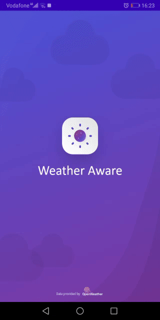
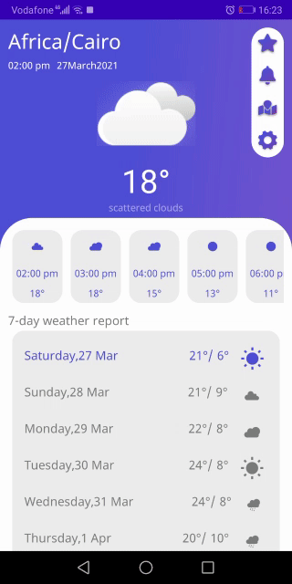
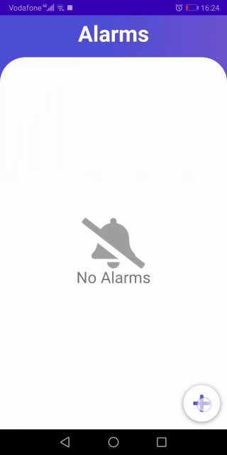
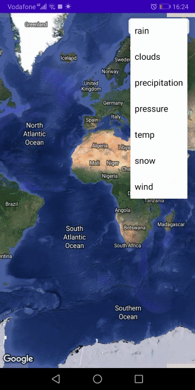
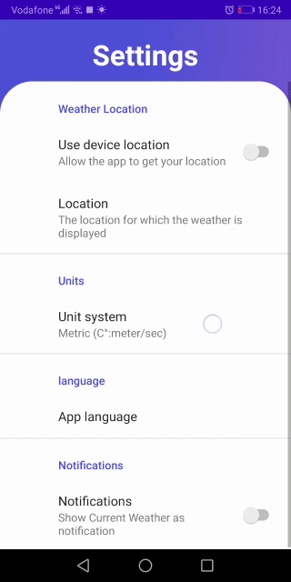

# WeatherApp

Android Mobile Application that displays the weather status and the temperature 
from your location. Also, you can pick a specific location on the map and add it to a 
list of favorite locations and get all the weather information at this location. In 
addition you can set an alert for rain, wind, fog, snow … etc.

<h2 id="Outputs">Outputs</h2>

# Features 
* MVVM architecture.
* Use [OpenWeatherMap](https://openweathermap.org/) API.
* Automatic notifications about weather alerts.
* Custom alarms in a specific time range .
* Change location provider (GPS, Google-Maps Location).
* Support two language (English, Arabic).
* Change temperature unit (Celsius, Kelvin, Fahrenheit).
* Change wind speed unit (m/s, mph).
* Local data with Room Persistence.
* Auto update weather per 15 minutes with Jetpack WorkManager.
## Built With 🛠
- [Kotlin](https://kotlinlang.org/) - First class and official programming language for Android development.
- [Coroutines](https://kotlinlang.org/docs/reference/coroutines-overview.html) - For asynchronous and more..
- [Flow](https://kotlin.github.io/kotlinx.coroutines/kotlinx-coroutines-core/kotlinx.coroutines.flow/-flow/) - A cold asynchronous data stream that sequentially emits values and completes normally or with an exception.
- [Android Architecture Components](https://developer.android.com/topic/libraries/architecture) - Collection of libraries that help you design robust, testable, and maintainable apps.
  - [LiveData](https://developer.android.com/topic/libraries/architecture/livedata) - Data objects that notify views when the underlying database changes.
  - [ViewModel](https://developer.android.com/topic/libraries/architecture/viewmodel) - Stores UI-related data that isn't destroyed on UI changes. 
  - [Data Binding](https://developer.android.com/topic/libraries/data-binding) - Declaratively bind observable data to UI elements.
  - [Room](https://developer.android.com/topic/libraries/architecture/room) - SQLite object mapping library.
- [Dependency Injection](https://developer.android.com/training/dependency-injection) - 
  - [Hilt-Dagger](https://dagger.dev/hilt/) - Standard library to incorporate Dagger dependency injection into an Android application.
  - [Hilt-ViewModel](https://developer.android.com/training/dependency-injection/hilt-jetpack) - DI for injecting `ViewModel`.
- [Retrofit](https://square.github.io/retrofit/) - A type-safe HTTP client for Android and Java.
- [Moshi](https://github.com/square/moshi) - A modern JSON library for Kotlin and Java.
-  [Kotlin Serlization](https://github.com/Kotlin/kotlinx.serialization) - Kotlin Multiplatform Serialization
- [Material Components for Android](https://github.com/material-components/material-components-android) - Modular and customizable Material Design UI components for Android.
- [Splash Screen](https://developer.android.com/reference/android/window/SplashScreen) - Newly introduced splash screen API
-  [Work Manager](https://developer.android.com/reference/androidx/work/WorkManager) - Schedule background tasks
- [Lottie](https://github.com/airbnb/lottie-android) - Animation
- [Google Maps](https://developers.google.com/maps/documentation/android-sdk/start) - Embedded Google Maps
- [Glide](https://bumptech.github.io/glide/)- for image loading
- [JUnit](https://junit.org/junit4/) - Unit Testing
- [Truth](https://truth.dev/) - Fluent Assertions
- [Turbine](https://github.com/cashapp/turbine)-Turbine is a small testing library for kotlinx.coroutines Flow
- [Espresso](https://developer.android.com/training/testing/espresso)-write concise, beautiful, and reliable Android UI tests.

